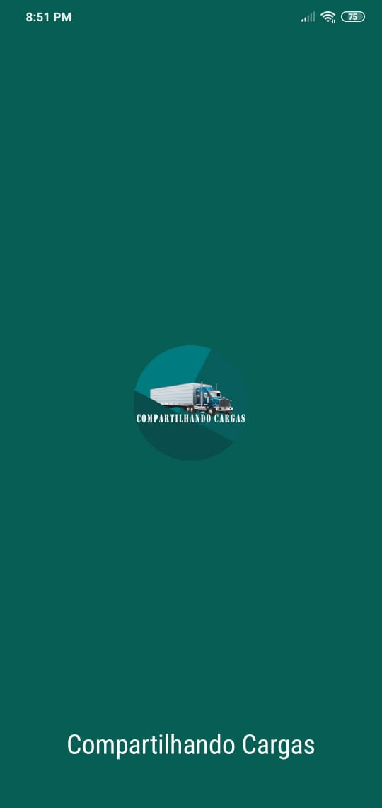
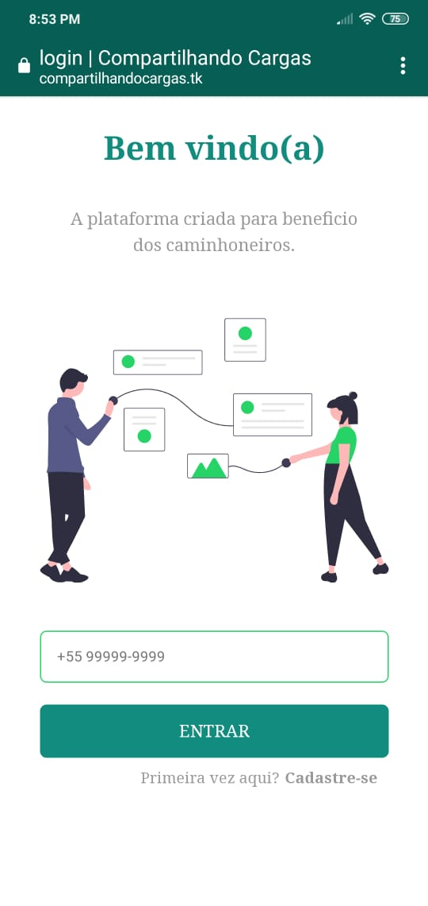

<!-- AUTO-GENERATED-CONTENT:START (STARTER) -->

  

<h1 align="center">
  Compartilhando Cargas
</h1>

## - 💻 Projeto

Plataforma onde o caminhoneiro pode encontrar e compartilhar conteúdos com amigos e ainda achar novos contatos de outros caminhoneiros de todo o Brasil.
[Mais informações](.github/cc.pdf)

## - 🎥 Video

[Video apresentação](https://www.youtube.com/watch?v=A_8QB-eltX0)

## - 🌐 Web

> https://compartilhandocargas.tk/

> https://compartilhando-cargas.netlify.app

## - 📱 Mobile

Acesse o site através dos links acima e aparecerá uma mensagem para instalar o app no smartphone (utilize o navegador chrome).

## - 📷 Imagens

    
    

